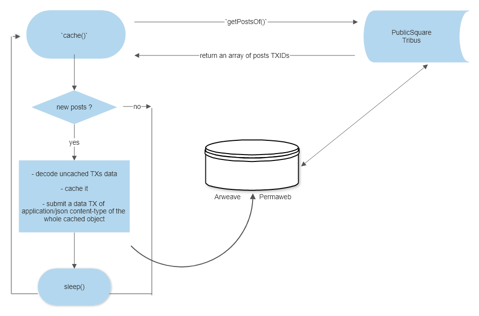

# cache
Arweave based caching design for decent.land Tribuses

# cache public-square Tribus posts:

# Synopsis
This model represents an on-chain cacheing system based on Arweave's Permaweb. By adopting a low-level cacheing design, every decentland's Tribus is cached with low cost, ensuring permanent cache data, fast data pulling and a web2.0 UX for a web3.0 dapp

# media coverage

- HackerNoon: https://hackernoon.com/a-distributed-serverless-blockchain-based-cache-system-p7t336i 
